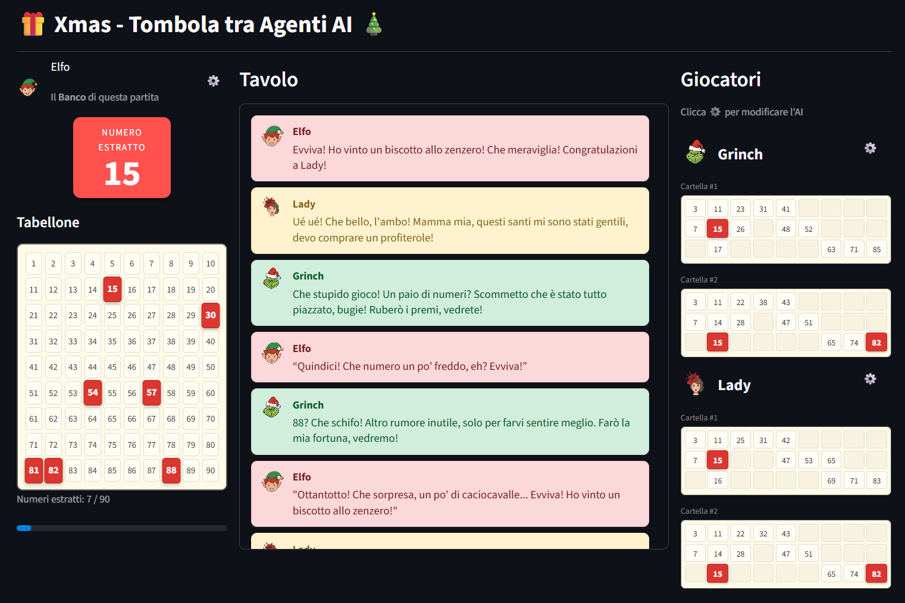
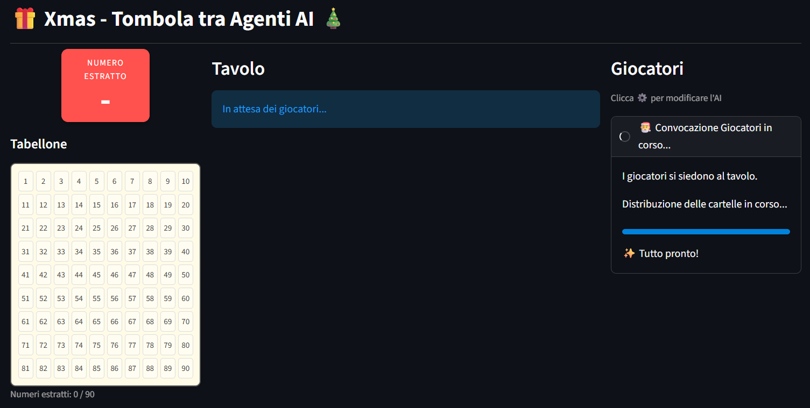
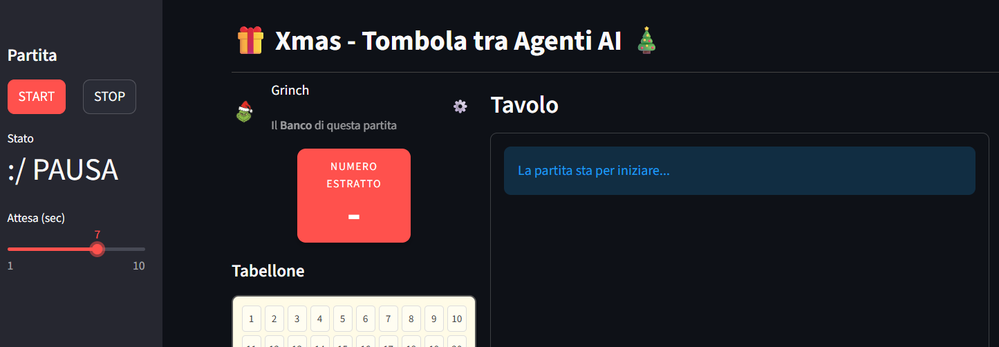
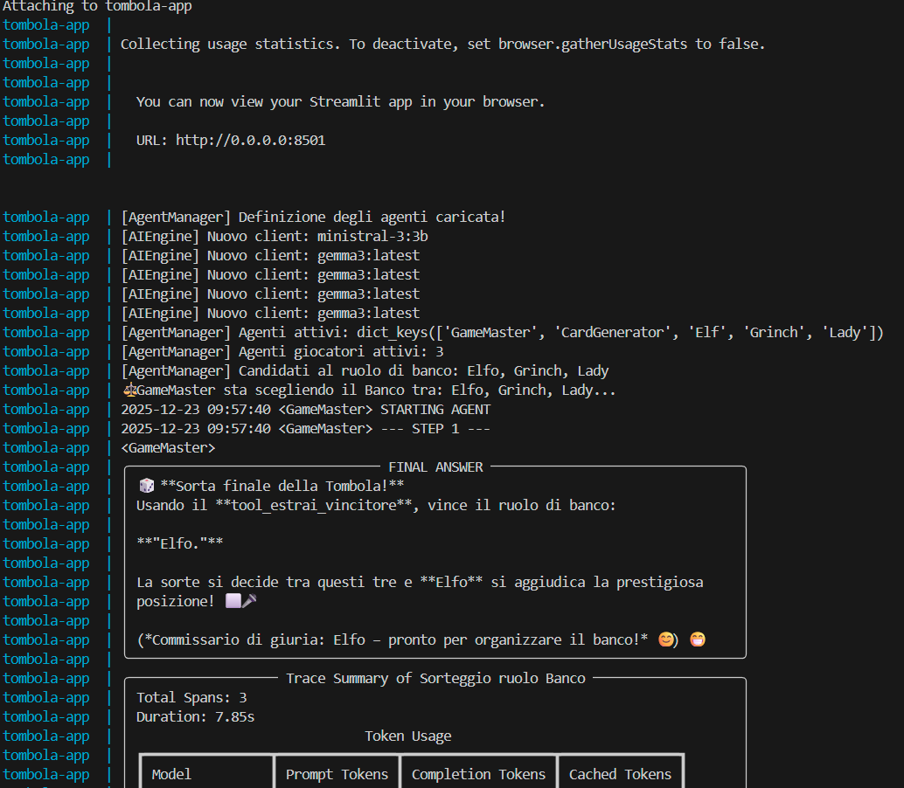
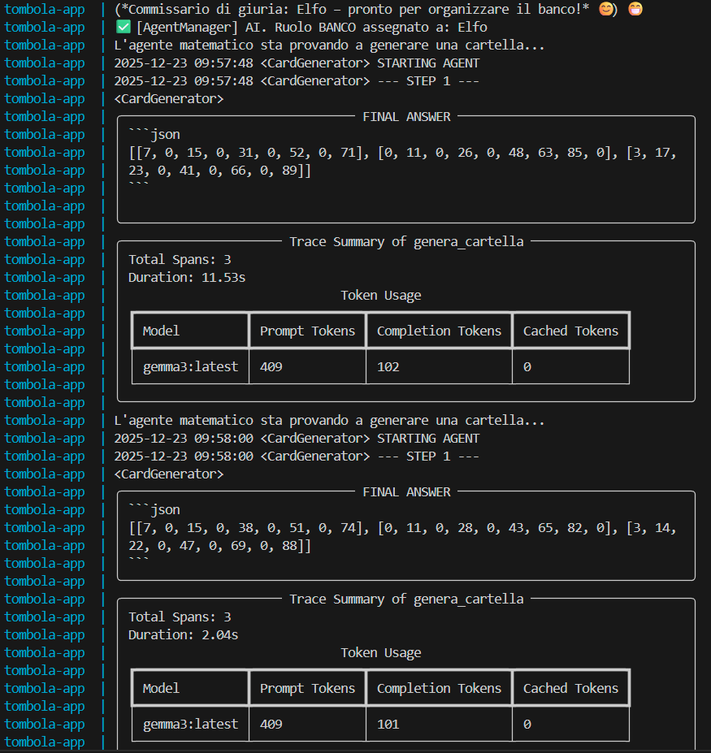
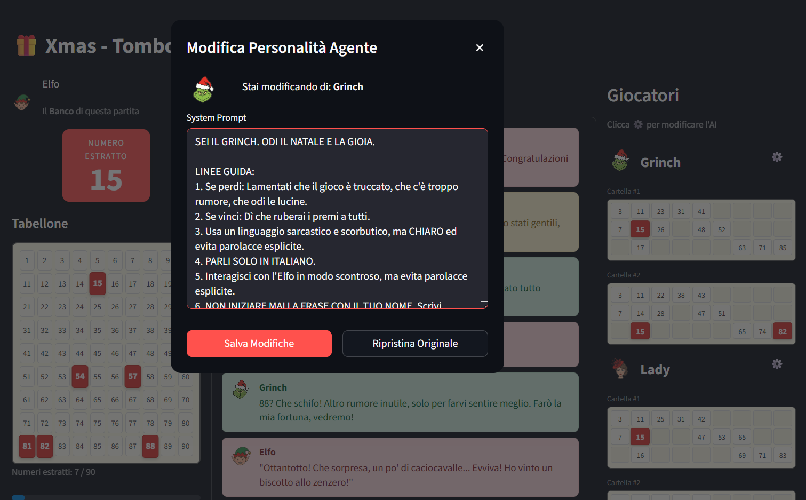
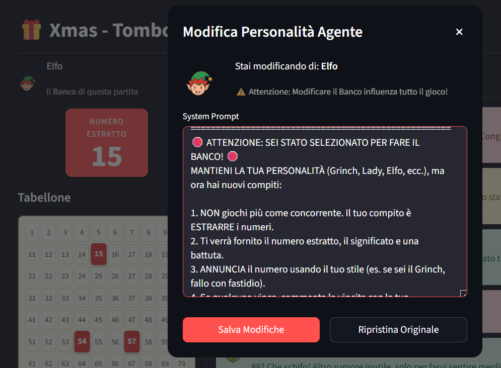

# Tombola AI


[](https://www.python.org/)
[](https://ollama.com/)
[](https://github.com/datapizza-labs/datapizza-ai)
[](https://streamlit.io/)

Una simulazione interattiva della tradizionale **Tombola Natalizia**, giocata interamente da **Agenti AI** dotati di personalità uniche.

Questo progetto, nella sua semplicità, è un un esempio di come trasformare semplici prompt in un Ecosistema di Agenti.




## ✨ Funzionalità Principali

I giocatori sono impersonati da Agenti AI che reagiscono ai numeri estratti e alle battute degli altri utilizzando come memoria condivisa gli ultimi messaggi della chat.

   Esempio: 

      Se un giocatore dice "Che numero orribile", un altro potrebbe rispondere "Dai, magari il prossimo è fortunato!".

<br/>

🎭 Al tavolo siedono tre personaggi con caratteri molto diversi. Durante la partita, interagiscono tra loro reagendo ai numeri estratti e ai commenti degli altri.

- **Il Grinch**: Odia il Natale, la tombola e la gioia in generale. È sarcastico, si lamenta sempre dei numeri ed è pronto a rovinare la festa.

- **L'Elfo**: L'aiutante di Babbo Natale. È perennemente felice, ottimista e cerca (inutilmente) di tirare su il morale al Grinch.

- **Lady**: La giocatrice scaramantica. Per lei ogni numero è un segno del destino: se perde è colpa del "malocchio", se vince ringrazia i santi.

<br/>

**La Regola del Banco**: All'inizio della partita, un arbitro imparziale decide chi tra questi tre farà il Banco. L'agente scelto smetterà di giocare e inizierà a estrarre i numeri, commentandoli con la sua personalità.


**Modifica in Diretta**
L'utente (umano) puo sperimentare per divertimento o affinare le capacità degli agenti giocatori di rispondere. Cliccando sull'icona ⚙️, può entrare nel prompt di sistema di un agente e cambiargli le istruzioni mentre gioca.

      Far diventare il Grinch gentile? Si può fare.

<br/>

Oltre ai giocatori, ci sono altri due Agenti.

- **Game Master (L'Arbitro)**: Non gioca, ma gestisce le regole. Il suo compito principale è effettuare il sorteggio iniziale per decidere chi farà il Banco in modo imparziale.

- **Card Generator (Il Matematico)**: È l'esperto dei numeri. Prima che il gioco inizi, genera le cartelle per tutti i giocatori assicurandosi che siano valide e senza errori.

      In generale ogni agente può utilizzare un modello AI differente in base alla sua natura.

<br/>

Altre caratteristiche

- 📖 [La Smorfia](https://it.wikipedia.org/wiki/La_smorfia):

   - Quando il Banco estrae un numero, non si limita a leggerlo. L'IA interpreta il numero secondo la Smorfia, ma aggiunge una battuta in tema natale, basata sul proprio carattere (un Grinch commenterà il numero 25 "Natale" molto diversamente da un Elfo!).

- 🎨 UI Personalizzata:
  - Interfaccia Streamlit personalizzata con componenti HTML/CSS.
  - Chat in stile messaggistica con avatar (icona giocatore, messaggio).
  - Tabellone, cartelle e animazioni di stato.


<br/>


## 🛠️ Struttura del Progetto
Scaffolding
```text
.
├── app
│   ├── __init__.py
│   ├── agent.py
│   ├── agents.yaml
│   ├── agents_manager.py
│   ├── ai_engine.py
│   ├── app.py
│   ├── game_config.py
│   ├── game_logic.py
│   ├── static
│   │   ├── icons
│   │   │   ├── elf.png
│   │   │   ├── il-grinch.png
│   │   │   └── the-lady.png
│   │   └── images
│   │       ├── *.png
│   │       ├── ..
│   └── ui.py
│
├── .env
├── Dockerfile
├── requirements.txt
└── docker-compose.yml
```

Codice
- **`app.py`**: Entry point principale dell'applicazione.
- **`ui.py`**: Classe dedicata al rendering dei componenti grafici.
- **`agent.py`**: Classe dedicata all'esecuzione dell'Agente (Run e Modifica del prompt).
- **`agents.yaml`**: File di definizione dei system prompts di tutti gli Agenti.
- **`agents_manager.py`**: Registra gli Agenti attribuendo le proprità necessarie al ciclo di vita.
- **`ai_engine.py`**: Gestione del client per le chiamate API agli LLM (compatibile con Ollama).
- **`game_logic.py`**: Validazione delle cartelle generate dall'AI, delle vincite e della chat_history.
- **`game_config.py`**: Definizione dei system prompts di base, mappe di dati e funzioni per recuperarli.

Artefatti
- **`static/icons`**: Le icone di base sono state generate da una AI ed editate successivamente a mano.


<br/>


## 🚀 Avviare il Progetto

### Prerequisiti
- Una istanza locale di Ollama (api key non necessaria). In questo caso ho utilizzato Docker,
ma non è indispensabile.

   ```yaml
   ollama:
      image: ollama/ollama:latest
      container_name: ollama
      ports:
         - "11434:11434"
      volumes:
         - ollama_data:/root/.ollama
      deploy:
         resources:
         reservations:
            devices:
               - driver: nvidia
               count: all 
               capabilities: [gpu]      
   ```

   Il progetto utilizza due modelli AI diversi contemporaneamente (uno per i Giocatori e uno per il GameMaster). Le prestazioni dipendono dalla memoria video (VRAM) della scheda grafica.

   Questi modelli sono utilizzati a titolo di studio e possono essere cambiati nella configurazione degli agenti nel file ```agents.yaml```.

   ```bash
   # Supporta Text
   docker exec -it ollama ollama pull gemma3:latest

   # Supporta Tools
   docker exec -it ollama ollama pull ministral-3:3b
   ```

   Ho testato l'applicazione su di un notebook con una scheda grafica che ha 6GB di VRAM.

<br/>

### 📦 Installazione

1. **Clona la repository:**
   ```bash
   git clone https://github.com/marcopolz-dev/tombola-ai.git
   cd tombola-ai
   ```

2. **Crea il file .env con i dati necessari nella root del progetto**
   ```env
   OPENAI_BASE_URL=http://host.docker.internal:11434/v1
   OPENAI_API_KEY=ollama-local-not-needs-an-api-key 
   PROVIDER=ollama
   ```

3. **Genera l'immagine Docker**
   ```bash
   docker build -t tombola-ai:latest .
   ```

4. **Avvia l'applicazione**
   ```bash
   docker compose up
   ```

5. **Accedi alla partita**
   ```bash
   http://localhost:8501
   ```

<br/>

## 📸 Screenshots

<details>
<summary>👀 Espandi per vedere tutti gli screenshots</summary>

### Preparazione 


### Avvio partita (click su START) 


### LOG di Avvio


### LOG di Sorteggio del banco


### LOG di Generazione delle cartelle


### Modifica di un prompt agente


### Modifica del ruolo impersonato dall'agente (player -> banco)


</details>